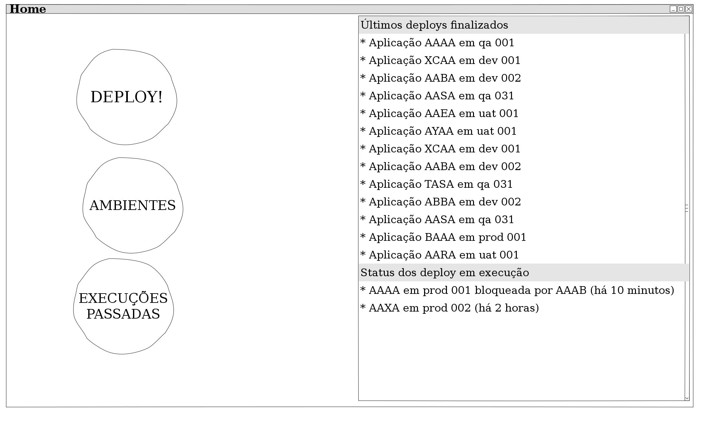
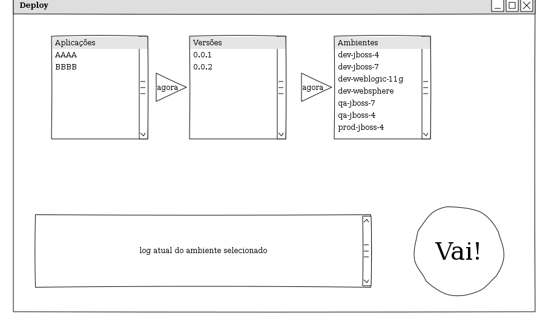

# Atividade: Elementos iniciais do projeto de Interfaces

Realize com o seu grupo a definição inicial do projeto de interfaces a ser desenvolvido como tarefa prática. Esta definição deve ser entregue até o final desta semana de atividades. Verifique o enunciado do trabalho prático (consulte o README.md) e *preencha os itens indicados na introdução* (item 1 do enunciado) . A versão final do projeto deve ser entregue na sexta semana de aula e valerá 5,5 pontos do GA.

A entrega da definição inicial do projeto nesta tarefa não valerá nota!

# Texto


## Introdução

### Descrição sucinta do sistema

Para uma empresa de desenvolvimento de software, em função dos processos assíncronos de desenvolvimento, testes de aceitação e posterior entrega em produção, há um sistema para controle dos deploys efetuados em diversos servidores na cloud privada que a empresa possui. Para gerenciamento destes deploys eram utilizadas planilhas excel e arquivos de texto. Em função do excesso de sobreposição de versões em diversos ambientes, optou-se por criar um pequeno sistema web que:
* exiba o status de todos os servidores: aplicações em execução, solicitantes, data de deploy, etc
* forneça acesso ao andamento de um deploy, que deve ser consultado em um REST service de uma ferramenta externa (jenkins-ci e rundeck)
* envie notificações por e-mail/skype chat de quando um deploy request colidiu com outro

### Descrição de um cenário geral de uso do sistema

```
Como responsável pelos testes de aceitação
Quando qualquer pessoa solicitar um deploy em ambiente de UAT (user acceptance test)
Então o sistema deve notificar do inicio de atualização
E avisar também o solicitante do deploy
E avisar também a pessoa que realizou o último deploy em execução
```  
    

### Descrição do tipo de público alvo

O público alvo do sistema é tipicamente uma equipe envolvida no desenvolvimento de software tradicional:

* gerentes de projeto
* desenvolvedores
* analistas de testes e qualidade
* coordenadores e gestores de pessoas

### Apresentação sucinta das alternativas tecnológicas a serem consideradas
Em função da relativa simplicidade tecnológica do sistema, que basicamente será composto de atualizações em real-time e consulta a REST services, a alternativa tecnológica mais adequada, em princípio, seria o uso de um framework Python ou Ruby para desenvolvimento leve, em conjunto com Framework JS para desenvolvimento de interfaces como o Twitter Bootstrap.

Um exemplo seria o deploynator, da Etsy (http://codeascraft.com/2010/05/20/quantum-of-deployment/)


## Contexto de uso

### Ambiente

O ambiente do sistema é uma empresa de desenvolvimento de software que efetua deploy de aplicações em servidores locais e remotos para seus diversos clientes e para uso interno.

### Função

O sistema possui duas funções primárias: 
* indicar o status atual dos deploys efetuados e em execução;
* permitir aos usuários que disparem deploys através da interface, desconhecendo a arquitetura dos servidores em questão

### Entradas

As principais entradas do sistema, tratadas neste documento, são:
* Versão do sistema a ser implantada, para executar deploys
* Ambiente em questão onde o deploy ocorreu, para identificar os deploys efetuados

### Saídas

As principais saídas do sistema são:
* Mapa de todos os deploys efetuados
* Dados detalhados de cada deploy efetuado
* Status atual do deploy

## Tipos de usuários envolvidos

Os usuários do sistema devem possuir conhecimento mínimo dos processos de deploy de aplicações.

## Principais tarefas previstas

* Consulta do estado geral do ambiente
* Execução de deploy


## Características da interface 
 
A interface será, em primeira instância, 100% web. A simplicidade da interface é proposital, em função dos diferentes níveis de usuários que podem ser encontrados e do aspecto extremamente técnico da solução, cujos usuários em média estão mais atentos a facilidade de encontrar as informações. Abaixo seguem dois sketches de interface:

### Página inicial

Esta página permite a consulta do estado geral do ambiente, através das listagens dos últimos deploys executados, bem como seu resultado, e do status dos deploys em execução. Todos os deploys são links para acesso ao log atual dos mesmos.

Além do status, as demais funcionalidades do sistema são acessíveis através desta tela:
* a execução de deploy
* a descrição dos ambientes e aplicações em execução
* o status atual das execuções e as execuções passadas, em maiores detalhes


### Página de deploy

A página de deploy tem como estado inicial apenas a seleção das aplicações. Apenas após a seleção de uma das aplicações, a seleção de versão se torna disponível. A seleção da versão libera o acesso para a seleção de ambientes. Após completar a seleção, a execução do deploy pode ser disparada, e seu status acompanhado na tela inicial do sistema.


